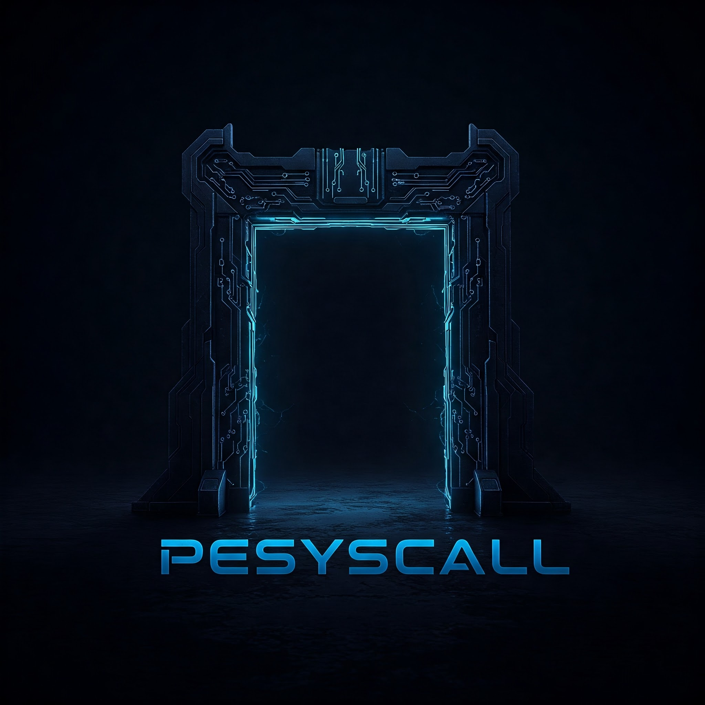
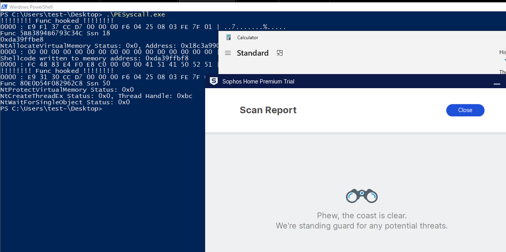

# PESyscall

Alternative SSN resolution: Reading ntdll.dll directly from disk

This project originated from studying well-known Windows dynamic system call techniques like Hell’s Gate, Halo’s Gate, and Tartarus' Gate, along with the methods they employ to resolve current System Service Numbers (SSNs).

As an alternative to reading SSNs from the ntdll.dll library already loaded into memory (which may potentially be hooked), this project implements a method based on reading and parsing a 'clean' copy of ntdll.dll directly from the local disk. The SSN obtained this way is subsequently used to perform a direct system call via an assembly wrapper (similar to Hell's Gate), allowing user-mode hooks to be bypassed.

# **Additional Testing Details:**

1. **Shellcode Generation:** The shellcode was generated using the `msfvenom` tool. The chosen payload was a standard shellcode that launches the Windows calculator (`calc.exe`).
2. **Shellcode Obfuscation:** To mask the shellcode and make its detection by antivirus software more difficult, the `Shellcrypt` tool (repository: `iilegacyyii/Shellcrypt`) was employed. This tool allows for the application of various obfuscation methods.
3. **Compilation:** The project was compiled using the `MinGW` (x64) compiler. This required making minor adjustments to the assembly (ASM) code to ensure correct compilation and compatibility with `MinGW`.
4. **Antivirus Testing:** Detection testing was performed using the `Sophos Home` antivirus solution (64-bit version) installed on the test system.

# Important Notes:

- I make no claims regarding the novelty of this approach. Techniques involving reading unmodified copies of system libraries from disk to bypass various user-mode hooks have been utilized by the security community for a considerable time.
- Furthermore, the presented code is not intended as a benchmark for an ideal or maximally optimized implementation. It primarily serves as an educational example and demonstrates one possible way to implement this technique.
- Any constructive feedback, recommendations, or ideas for improvement are welcome. Please feel free to open an issue in this repository if you have any suggestions.